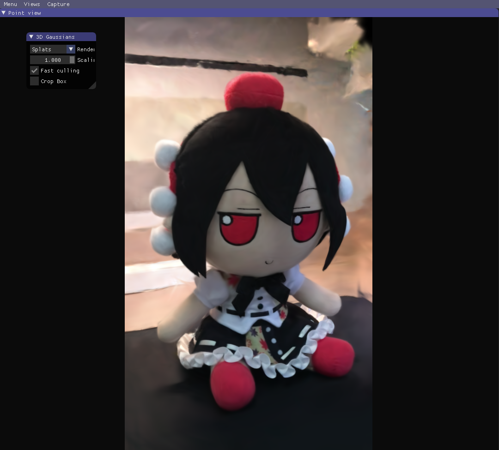
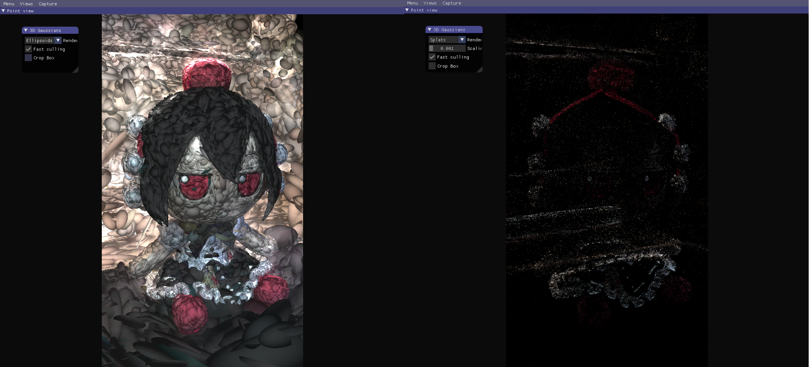
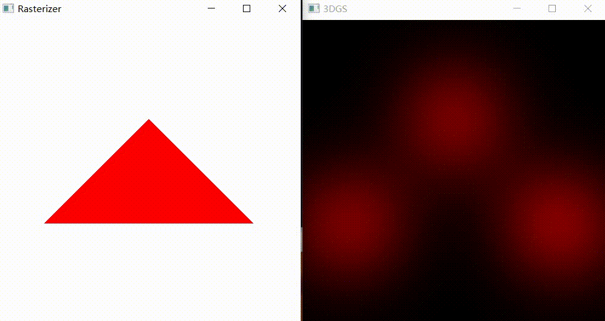

# 基于SFML的3D Gaussian Splatting基本复现

# SFML

[SFML](https://www.sfml-dev.org/)是一个很容易上手的多媒体图形库

如果要编译运行代码，需要配置SFML环境，可以参考[SFML and Visual Studio](https://www.sfml-dev.org/tutorials/2.6/start-vc.php)配置在Visual Studio上的环境

# 3DGS

[3D Gaussian Splatting](https://repo-sam.inria.fr/fungraph/3d-gaussian-splatting/)是SIGGRAPH 2023的一篇文章，据说三维重建的效果很好，我就想试一试，于是找到了[别人移植好的Windows项目](https://github.com/jonstephens85/gaussian-splatting-Windows)

我用手机绕着射命丸文的Fumo拍了两圈，差不多39秒的视频，剪切成78张图片用于训练

下图是3DGS迭代7000步跑出来的结果

可以看到，对于Fumo主体的重建效果还是很不错的，不过因为我没有着重拍摄环境，因此周围环境的重建就不能看了

不过毕竟这是拿手机随便拍摄的视频，有这质量还要啥自行车？

感觉这个很酷，因此尝试复现一下3DGS最基本的渲染过程

3DGS用初始点云计算出高斯椭球用于建模，如下图所示

# 项目介绍

根据[GAMES101](https://sites.cs.ucsb.edu/~lingqi/teaching/games101.html)的学习情况，编写了最基础的三角形光栅化程序，并支持旋转与复位操作，实时显示在Rasterizer窗口

根据[3DGS原论文](https://repo-sam.inria.fr/fungraph/3d-gaussian-splatting/)和[讲人话 3d gaussian splatting全解](https://www.bilibili.com/video/BV1zi421v7Dr)视频讲解与对应的[代码](https://github.com/SY-007-Research/3dgs_render_python)，复现了3DGS渲染一个三角形面片的过程，即渲染三个顶点对应的高斯椭球，实时显示在3DGS窗口

可以借此程序对比3DGS渲染高斯椭球和传统三角形光栅化两种不同的渲染方法

# 实现结果

# 操作

WASDQE和鼠标左键控制三角形**旋转**

R键三角形**复位**

WS控制三角形绕X轴旋转

AD控制三角形绕Y轴旋转

QE控制三角形绕Z轴旋转

关闭Rasterizer窗口或cmd窗口即可结束程序

# 参考资料

[Getting Started With 3D Gaussian Splatting for Windows (Beginner Tutorial)](https://www.youtube.com/watch?v=UXtuigy_wYc)

[gaussian-splatting-Windows: 3D Gaussian Splatting for Real-Time Radiance Field Rendering](https://github.com/jonstephens85/gaussian-splatting-Windows)

[3D Gaussian Splatting](https://repo-sam.inria.fr/fungraph/3d-gaussian-splatting/)

[GAMES101: 现代计算机图形学入门](https://sites.cs.ucsb.edu/~lingqi/teaching/games101.html)

[3dgs_render_python](https://github.com/SY-007-Research/3dgs_render_python)

[讲人话 3d gaussian splatting全解](https://www.bilibili.com/video/BV1zi421v7Dr)

